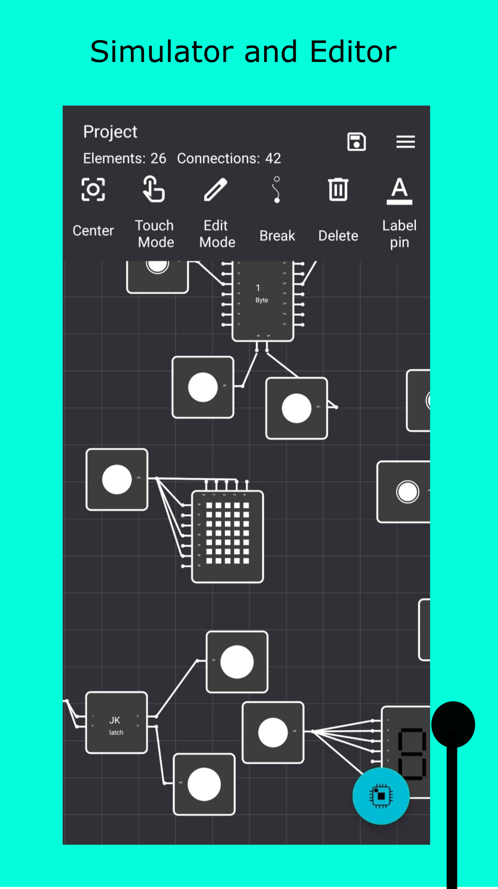
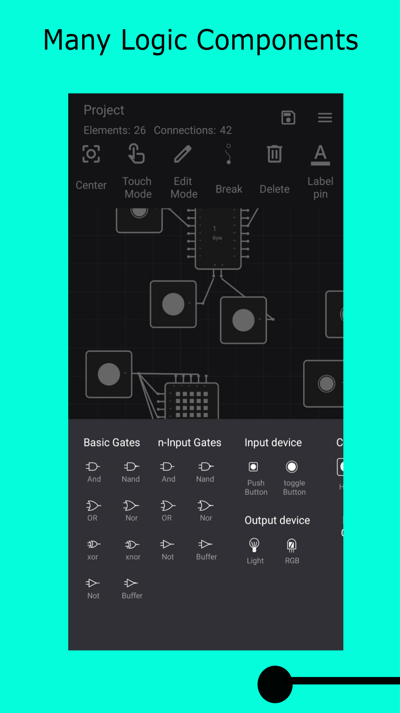
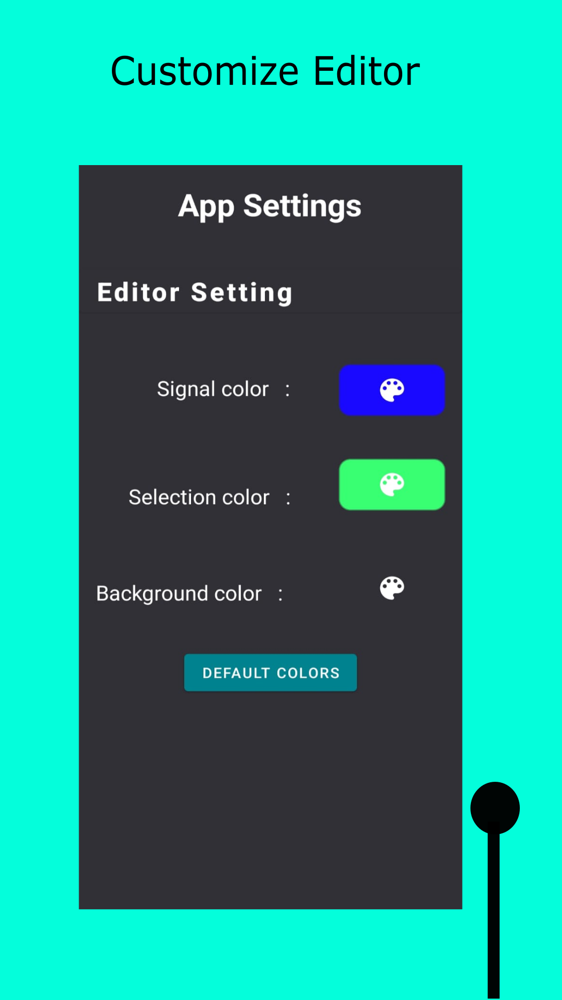
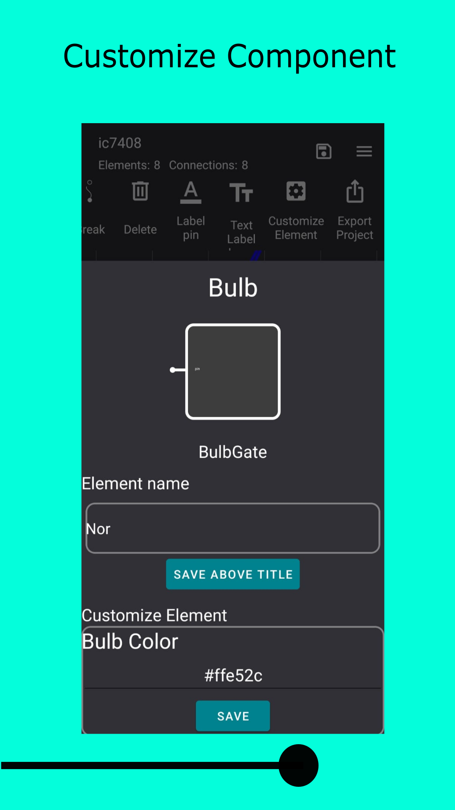

  

  <h2>LogicSimulator</h2>

  

<h2> Logic Simulator is a Android app to simulate Logic Gates connection </h2>

<table>
  <tr>
   <td></td>
   <td></td>
   <td></td>
   <td></td>
   </tr>
</table>

